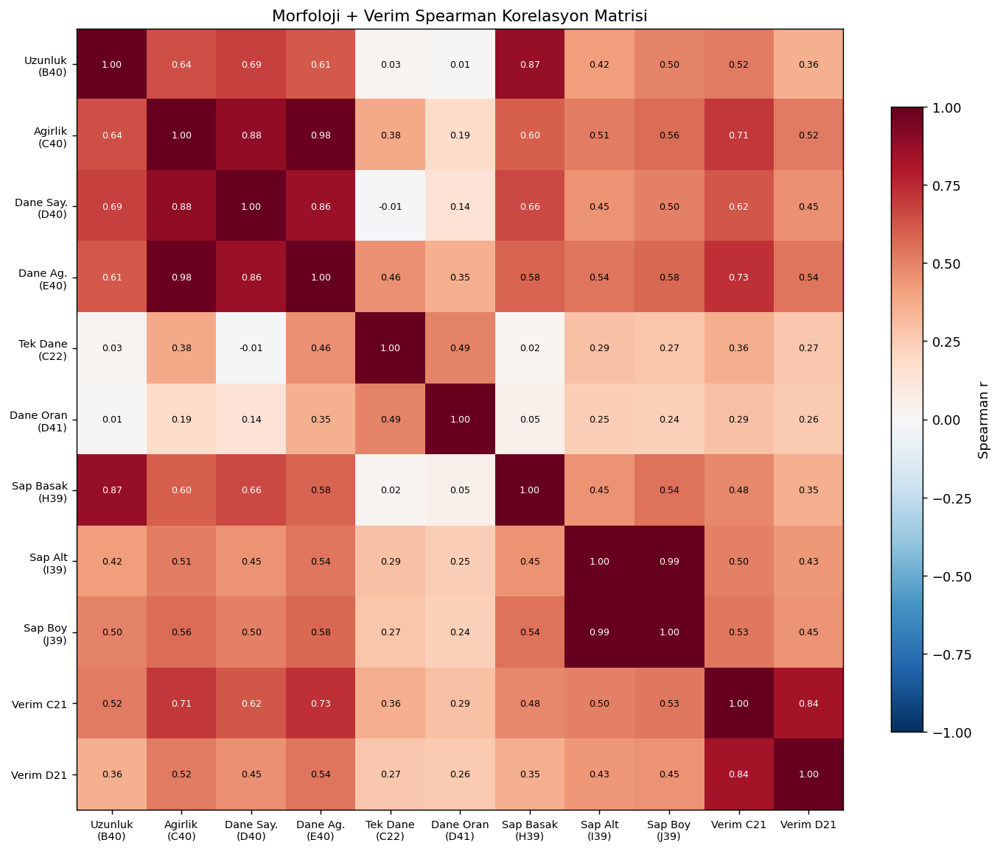
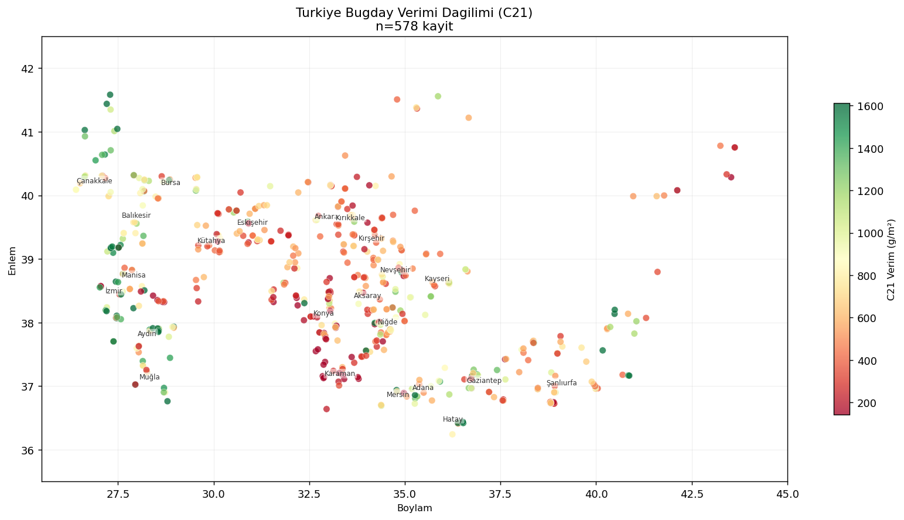

# UYSM: Wheat and Barley Yield Analysis from Field Data

<details>
<summary>🇹🇷 Türkçe özet için tıklayın</summary>

TARBİL (Tarımsal İzleme ve Bilgi Sistemi) kapsamında Türkiye genelinde toplanan buğday/arpa saha ölçüm verisinin işlenmesi ve istatistiksel analizi. İTÜ'de staj (2026 bahar) sürecinde başlayıp, staj sonrasında bağımsız olarak genişletilerek devam ettirilmiş, kurum onayıyla public paylaşılan bir çalışma.

**Ne yapıldı:** 291 istasyon dosyasıyla başlayan ilk aşamada, otomatik bir ETL pipeline'ı kuruldu; bu süreçte gerçek 2 hesaplama hatası bulunup düzeltildi. Staj sonrası bağımsız devamda veri seti ~800 ham ölçüme (79 il) genişletildi, ardından ~90 versiyonluk iteratif bir temizlik sürecinden geçirilip 617 analiz-hazır kayda (42 il) indirgendi; her bir kaybın nedeni tek tek belgelendi. Aykırı değer tespiti tek bir eşik yerine, akademik literatüre dayanan (Tukey 1977, Iglewicz & Hoaglin 1993) çok aşamalı bir yöntemle (seri-içi MAD, global IQR, global MAD) yapıldı.

**Bulgular:** başak ağırlığı ile verim arasında güçlü korelasyon (r=0.701), il bazında sap boyu ile verim arasında da güçlü ilişki (r=0.724); iki farklı verim hesaplama yöntemi güçlü uyum gösteriyor (r=0.820) ama sistematik ~%12 fark var; enlem/boylamla doğrudan anlamlı bir ilişki yok; bölgesel farkların iklim/sulama/çeşit gibi il-bazlı faktörlerden kaynaklandığını düşündürüyor. Ayrıntılar aşağıdaki İngilizce bölümde.

</details>

---

Processing and statistical analysis of wheat and barley field measurement data collected across Türkiye under TARBİL (Tarımsal İzleme ve Bilgi Sistemi, the National Agricultural Monitoring and Information System). The work started during an internship at İTÜ (spring 2026) and kept growing independently afterward, now shared publicly with institutional approval.

## What was done

**Stage 1, during the internship:** UYSM's archive held 291 Excel files, one per station measurement day, with no automated way to consolidate or check them. I built a Python ETL pipeline that extracted, validated, and merged all 291 into one analysis-ready dataset. Along the way it caught two real calculation errors baked into the source spreadsheets: a template cell that should have held a `SUM` formula instead held a leftover constant (`948`) in 12 files, silently shrinking the reported yield by a factor of 10 to 25; and 8 files where only 9 of the required 10 ear measurements were filled in, while Excel kept dividing by 10 regardless, understating the average by about 11%. Both were detected by recomputing every value from the raw measurement rows and flagging mismatches, then corrected. Geographic coordinates, stored as raw integers in the source files, were decoded and validated against Türkiye's administrative boundaries with an 11 km buffer for coastal stations. Of 291 source files, 239 passed validation and were included in the final dataset.

**Stage 2, after the internship, independent:** I kept going on my own. The source data grew to roughly 800 raw measurements across 79 provinces, combining a newer 769-file set (Hansay) with an older, partially overlapping 291-file set. Getting from that raw pool to something trustworthy enough to analyze took real, sustained effort: the pipeline went through about 90 iterative versions, and every single row or cell that got dropped along the way is documented with a reason, not just discarded silently. The final analysis-ready dataset is **617 records across 42 provinces**, a 19.8% reduction from the raw Hansay set, achieved through 24 distinct, individually justified cleaning steps: filtering out ambiguous crop-type entries, dropping records with unrecoverable coordinates, catching duplicate rows (including a pair where all 10 individual ear measurements matched exactly, a statistical near-impossibility), and separating wheat from barley.

Cell-level outlier detection went further than a single pass. It ran in stages: a conservative within-series check (each station's own 10 ear measurements compared against each other, threshold relaxed to account for the small sample size), a global 3×IQR pass to catch obvious data-entry errors (unit mix-ups, decimal slips), and then a global Modified Z-Score pass (threshold 3.5, following Iglewicz & Hoaglin 1993) to catch subtler population-level deviations, applied separately to raw measurements and to every derived column. Outlier cells were nulled rather than the whole row dropped, and every downstream average was recalculated with `mean(skipna=True)` so a handful of bad cells never silently corrupted a station's summary statistics. The reasoning behind each threshold choice, including why IQR was applied before MAD and why the within-series threshold differs from the global one, is written up with citations (Tukey 1977; Iglewicz & Hoaglin 1993; Leys et al., 2013).

## Results

**Yield estimates from two independent methods agree, with a systematic offset.** The dataset carries two ways of estimating grain yield per square meter: one from counting ears and multiplying by average grain weight per ear, the other from directly weighing the harvested sample. The two agree strongly (r = 0.820, p < 10⁻¹³⁹, n = 569), but the count-based method runs about 12.3% higher on average (Bland-Altman analysis), with wide individual-record limits of agreement (−61.5% to +86.1%). Whichever method a future analysis uses should be stated explicitly; they aren't interchangeable at the record level.

**Ear weight and stem length are the strongest predictors of yield.** Spearman correlations: ear weight to yield, r = 0.701; grain count per ear to yield, r = 0.612; and, at the province level, stem length to yield, r = 0.724.



**Geography matters at the province level, but not as a simple latitude/longitude gradient.** Yield is visibly higher in Marmara and Aegean provinces and lower in the dry-farmed interior (Konya, Karaman, Niğde), but a direct correlation test against raw latitude and longitude turns up essentially nothing (all \|r\| < 0.14 except one weak, likely artifactual link between longitude and ear count). The province-level pattern is real; it just isn't explained by geographic position alone; climate zone, irrigation access, and variety choice are the more likely drivers.



**A methodological catch worth flagging on its own.** Records measured over a 1/16 m² plot showed roughly double the yield of records measured over 1/4 m² or 1/8 m² plots (Kruskal-Wallis H = 91.96, p < 0.0001). That's very unlikely to be a real agronomic effect; it looks like a scaling artifact where a small measurement area amplifies noise when multiplied up to a full square meter. Flagged in the write-up rather than treated as a finding, and a candidate for normalization in any follow-up work.

**A biological sanity check passed.** Grain-weight-to-ear-weight ratio, which cannot physically exceed 1, has zero records above 1 in the cleaned dataset, confirming the outlier pipeline correctly caught the impossible values rather than leaving them to distort later statistics.

Full category-by-category breakdown (descriptive statistics, geographic analysis, measurement-area effects, morphology, yield components, stem length, coordinate correlation), every supporting chart, and the province-level summary table: [`02_genisletilmis_analiz/output/ANALIZ_OZET.md`](02_genisletilmis_analiz/output/ANALIZ_OZET.md).

## Repository structure

```
wheat_barley_yield_analysis/
├── 01_ilk_pipeline/          Stage 1: the internship-era ETL (291 files -> 239 clean records)
│   ├── scripts/                Extraction, validation, geocoding, visualization
│   └── docs/                   Excel layout reference, data-issue log
└── 02_genisletilmis_analiz/  Stage 2: the independent continuation (-> 617 records, 42 provinces)
    ├── scripts/                Iterative pipeline + statistical analysis scripts
    ├── docs/                   Data-loss chronicle, outlier methodology (with citations), column reference
    └── output/                 Analysis results: ANALIZ_OZET.md plus every chart and summary CSV
```

Raw and intermediate institutional data (source spreadsheets, per-version processed CSVs, coordinate maps, province-level reference tables) are git-ignored throughout, since that data belongs to TARBİL/İTÜ UHUZAM rather than to me. What's in the repository, the code, the methodology write-ups, and the aggregate statistical output, is complete and legible on its own.

## Tools

Python: `pandas` for the pipeline and analysis, `openpyxl` for reading the source spreadsheets, `geopandas`/`shapely` for geographic validation, `scipy.stats` for the statistical tests (Spearman, Kruskal-Wallis, Bland-Altman, Modified Z-Score), `folium` for interactive maps, `matplotlib`/`seaborn` for charts.
